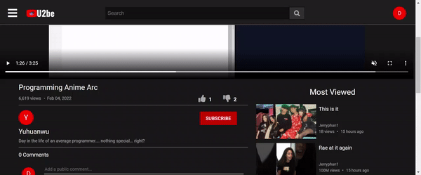
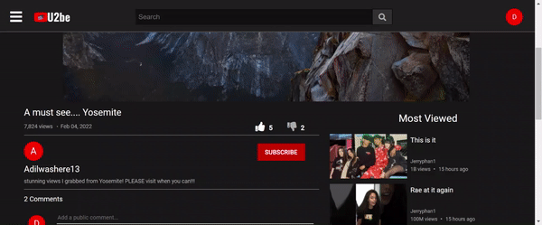

# README


## Summary

U2be is a Youtube inspired clone where users can follow their dreams and do just about anything you would on the original. From uploading and watching videos, to leaving comments that you can edit. U2be has it all! If you don't believe me... see for yourself! [U2be](https://the-u2be.herokuapp.com/#/)

## Technologies

* Heroku / AWS
* Ruby on Rails
* React / Redux
* JavaScript / AJAX / JBuilder
* HTML5 / CSS
* PostgreSQL

## Features 

* Videos preview on hover


```javascript 
  handleMouseEnter(e) {
    e.preventDefault();
    {
      if (e.target.className === 'index-actual-video' ) {
      this.startPreview(e.target);
      setTimeout(() => this.stopPreview(e.target),4000)
      }
    } 
  }

    startPreview(target) {
    target.muted = true;
    target.currentTime = 1;
    target.playbackRate = 0.5;
    target.play()
  }
  
  stopPreview(target){
    target.currentTime = 0;
    target.playbackRate = 1;
    target.pause();
    target.load();
  }

```

* Comments on videos


* Like or Dislike a video


* Increasing video views


* Subscribe to channel


## Upcoming Features

* Like and Dislike Comments 
* Channel pictures and banners
* Mobile friendly 

## Shoutout

* StackOverflow
* Youtube
* Yu-Huan Wu
* Valkyrae